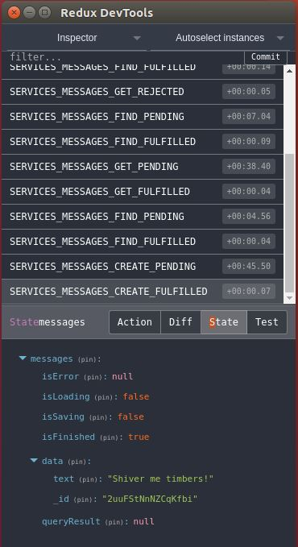

# feathers-redux

[](https://travis-ci.org/feathersjs/feathers-redux)
[](https://codeclimate.com/github/feathersjs/feathers-redux)
[](https://codeclimate.com/github/feathersjs/feathers-redux/coverage)
[](https://david-dm.org/feathersjs/feathers-redux)
[](https://www.npmjs.com/package/feathers-redux)

> Integrate Feathers services with your Redux store

## Example

On server:
```javascript
app.use('/users', ...);
app.use('/messages', ...);
```
On client:
```javascript
import reduxifyServices from 'feathers-redux';
const feathersClient = feathers(). ...;

// Create Redux actions and reducers for Feathers services
const services = reduxifyServices(feathersClient, ['users', 'messages']);

// Configure Redux store & reducers
export default combineReducers({
  users: services.users.reducer,
  messages: services.messages.reducer,
});

// Feathers service calls may now be dispatched.
store.dispatch(services.messages.get('557XxUL8PalGMgOo'));
store.dispatch(services.messages.find());
store.dispatch(services.messages.create({ text: 'Hello!' }));
```

[](https://chrome.google.com/webstore/detail/redux-devtools/lmhkpmbekcpmknklioeibfkpmmfibljd?utm_source=chrome-app-launcher-info-dialog)


## Installation

```
npm install feathers-redux --save
```

## Documentation: reduxifyServices

```javascript
import reduxifyServices from 'feathers-redux';
const services = reduxifyServices(app, serviceNames, options);
```

__Options:__

- `app` (*required*) - The Feathers client app.
- `serviceNames` (*required*, string, array of strings, or object) - The
paths of the Feathers services to reduxify.
    - `'messages'` is short for `{ messages: 'messages' }`.
    You can dispatch calls with `dispatch(services.messages.create(data, params));`.
    - `['users', 'messages']` is short for `{ users: 'users', messages: 'messages' }`.
    - `{ '/buildings/:buildingid': 'buildings' }` will reduxify the Feathers service
    configured with the path `/buildings/:buildingid`.
    You can dispatch calls with `dispatch(services.buildings.create(data, params));`.
- `options` (*optional*) - Names for props in the Redux store,
and for string fragments in the action constants.
The default is
```javascript
{ // Names of props for service's Redux state
  idField: 'id',
  isError: 'isError', // e.g. state.messages.isError
  isLoading: 'isLoading',
  isSaving: 'isSaving',
  isFinished: 'isFinished',
  data: 'data',
  queryResult: 'queryResult',
  store: 'store',
  // Fragments to form action constants
  PENDING: 'PENDING', // e.g. MESSAGES_CREATE_PENDING
  FULFILLED: 'FULFILLED',
  REJECTED: 'REJECTED',
}
```
    
`reduxifyServices` returns an object of the form
```javascript
{
  messages: { // For the Feathers service with path /messages.
    // action creators
    create(data, params) {}, // Action creator for app.services('messages').create(data, params)
    update(id, data, params) {},
    patch(id, data, params) {},
    remove(id, params) {},
    find(params) {},
    get(id, params) {},
    store(object) {}, // Interface for realtime replication.
    reset() {}, // Reinitializes store for this service.
    // action types
    types: {
      RESET: 'RESET',
      STORE: 'STORE',
      SERVICES_MESSAGES_FIND: 'SERVICES_MESSAGES_FIND',
      SERVICES_MESSAGES_FIND_PENDING: 'SERVICES_MESSAGES_FIND_PENDING',
      SERVICES_MESSAGES_FIND_FULFILLED: 'SERVICES_MESSAGES_FIND_FULFILLED',
      SERVICES_MESSAGES_FIND_REJECTED: 'SERVICES_MESSAGES_FIND_REJECTED',
      // same for all methods GET, CREATE...
    },
    // reducer
    reducer() {}, // Reducers handling actions MESSAGES_CREATE_PENDING, _FULFILLED, and _REJECTED.
  },
  users: { ... },
}
```

Service calls may be dispatched by
```javascript
dispatch(services.messages.create(data, params));
```

Reducers may be combined with
```javascript
combineReducers({
  users: services.users.reducer,
  messages: services.messages.reducer,
});
```

> **ProTip:** You have to include `redux-promise-middleware` and `redux-thunk`
in your middleware.

You may listen to actions dispatched by `feathers-redux`, for example to manage your side-effects. With `redux-saga`, it would be done with:
```javascript
yield take(services.users.types.SERVICES_USERS_CREATE_FULFILLED, function*(action) {
  // do something when user gets created
});
```

## Documentation: getServicesStatus

Its common for React apps to display info messages such as "Messages are being saved."
`getServicesStatus` returns a relevant message for the reduxified Feathers services.


```javascript
import reduxifyServices, { getServicesStatus } from 'feathers-redux';
const msg = getServicesStatus(state, serviceNames)
```

__Options:__

- `state` (*required*) - The state containing state for the services.
- `serviceNames` (*required*, string, array of strings) - The
names of the Feathers services.

The services are checked from left to right.
They first are checked for an error condition (`isError`),
and if an error is found the function returns an object similar to
```javascript
{ message: 'users: Error.message',
  className = Error.className, // Can be used to internationalize the message.
  serviceName = 'users';
}
```

Next they are check for loading or saving,
and if one is found the function returns an object similar to
```javascript
{ message: 'users is loading',
  className = 'isLoading', // Or isSaving.
  serviceName = 'users';
}
```

Otherwise the object is returned with empty strings.

## Realtime replication

The Feathers read-only, realtime replication engine is
[`feathers-offline-realtime`](https://github.com/feathersjs/feathers-offline-realtime).
You can connect this engine with
```javascript
const Realtime = require('feathers-offline-realtime');
const messages = feathersClient.service('/messages');

const messagesRealtime = new Realtime(messages, { subscriber: (records, last) => {
  store.dispatch(services.messages.store({ connected: messagesRealtime.connected, last, records }));
} });
```

## Shape of the store

The above code produces a state shaped like
```javascript
state = {
  messages: {
    isLoading: boolean, // If get or find have started
    isSaving: boolean, // If update, patch or remove have started
    isFinished: boolean, // If last call finished successfully
    isError: Feathers error, // If last call was unsuccessful
    data: hook.result, // Results from other than a find call
    queryResult: hook.result, // Results from a find call. May be paginated.
    store: {
      connected: boolean, // If replication engine still listening for Feathers service events
      last: { // Read https://github.com/feathersjs/feathers-offline-realtime#event-information.
        action: string, // Replication action.
        eventName: string, // Feathers service event name. e.g. created
        records: object, // Feathers service event record.
      },
      records: [ objects ], // Sorted near realtime contents of remote service
    },
  },
  users: { ... },
};
```

## Autobind Action Creators

Method to bind a given dispatch function with the passed services. 
This helps with not having to pass down `store.dispatch` as a prop everywhere the service is being used. Read More: http://redux.js.org/docs/api/bindActionCreators.html
```js
import reduxifyServices, { bindWithDispatch } from 'feathers-redux';

// create a services object as described above 
const rawServices = reduxifyServices(...);

// create a store with rootReducer combining reducers from rawServices
const store = createStore(...)

// use the bindWithDispatch method to bind rawServices' action creators with store.dispatch
const services = bindWithDispatch(store.dispatch, rawServices)
```
```js
// before 
store.dispatch(services.messages.get('557XxUL8PalGMgOo'));
store.dispatch(services.messages.find());
store.dispatch(services.messages.create({ text: 'Hello!' }));

// after
services.messages.get('557XxUL8PalGMgOo');
services.messages.find();
services.messages.create({ text: 'Hello!' });
```

## Realtime Feathers Updates

If any of your services need real time updates, you can dispatch any of the following actions depending on your use case:
```javascript
    dispatch(services.messages.onCreated(data));
    dispatch(services.messages.onUpdated(data));
    dispatch(services.messages.onPatched(data));
    dispatch(services.messages.onRemoved(data));
```

In order for the redux store to update in realtime, these action dispatches should be encapsulated within feathers `service.on()` event listener:
```javascript
 const messages = app.service('/messages');

 messages.on('created', (data) => {
      dispatch(services.messages.onCreated(data));
  })
  messages.on('updated', (data) => {
      dispatch(services.messages.onUpdated(data));
  })
  messages.on('patched', (data) => {
      dispatch(services.messages.onPatched(data));
  })
  messages.on('removed', (data) => {
      dispatch(services.messages.onRemoved(data));
  })
```

Note: `idField` is used to match events with correct objects.

## Action Pending/Loading

The following properties exist in all of the feather services:
```javascript
  const pendingDefaults = {
    createPending: false,
    findPending: false,
    getPending: false,
    updatePending: false,
    patchPending: false,
    removePending: false
  };
```

The service pending state will be updated according to the dispatched action.
```javascript
    dispatch(services.messages.create({ text: 'Hello!' })) `will update the state to:` createPending: true
    dispatch(services.messages.find()) `will update the state to:` findPending: true 
    dispatch(services.messages.get('557XxUL8PalGMgOo')) `will update the state to:` getPending: true
    dispatch(services.messages.update(id, data) `will update the state to:` updatePending: true
    dispatch(services.messages.patch(id, data) `will update the state to:` patchPending: true
    dispatch(services.messages.remove(id, params) `will update the state to:` removePending: true
```

## Examples

`example/` contains an example you may run. Its README has instructions.

`feathers-redux/test/integration.test.js` may answer any questions regarding details.

## License

Copyright (c) 2017

Licensed under the [MIT license](LICENSE).
